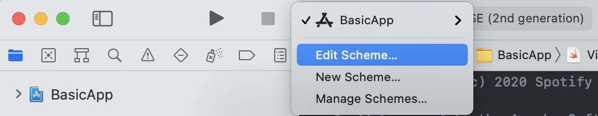
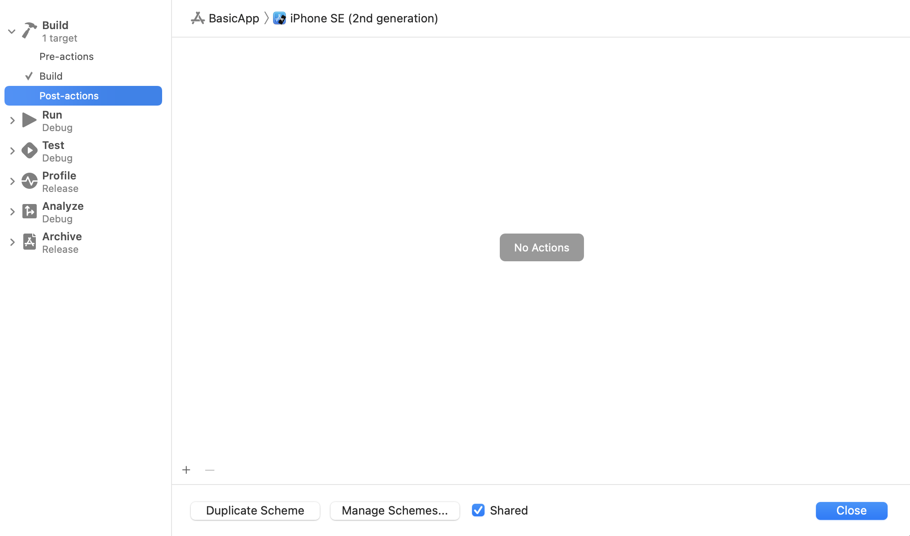
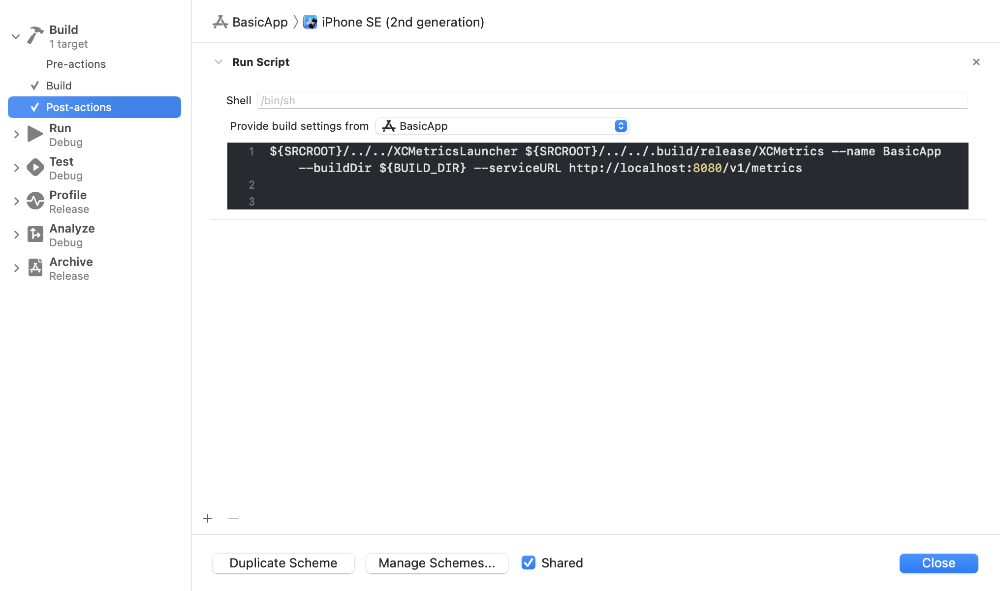

# Getting Started

There are two ways to integrate `XCMetrics` in your project. Based on how much customizability you need and the kind of metrics you'd like to collect, you'll need to take your decision. Here we describe the two approaches.

## Approach #1: Default Metrics Collection

`XCMetrics` supports a few arguments out of the box that allow you to start sending the default set of metrics to any supported backend service. In this getting started guide, we will show how to integrate `XCMetrics` in our example project named `BasicApp`. You can find the completed example app in the [Examples/BasicApp](https://github.com/spotify/XCMetrics/blob/main/Examples/BasicApp/) directory. Feel free to follow along with your own project.

One of the pre-requisites is to get a binary release of XCMetrics directly from our GitHub repo or compile it locally. In this case, we'll compile it locally since it's already in the repo, but we recommend to package it and download it as part of your project configuration steps in order to save time to your developers.

>If you're downloading a pre-built executable version of XCMetrics, you can skip the following section.

#### Compile XCMetrics Executable
In a terminal window inside the `XCMetrics` repo, run the following:

```shell
swift build --product XCMetrics -c release
```

An executable named `XCMetrics` will be place inside `.build/release/XCMetrics`. This is the executable that manages the metrics collection for you.

#### Xcode Integration
Now that we have an `XCMetrics` executable, we can proceed with the integration in your project. Open your `xcodeproj` (`BasicApp.xcodeproj` if you're following our example), select your scheme and press "Edit Scheme".



Expand the "Build" left panel to reveal pre and post-actions. Let's create a new post-action by pressing on the "+" button.



Make sure to select your target in "Provide build settings from" in order to provide the build settings to the post-action scheme (required for the next step). Paste the following script in the text area:

```shell
${SRCROOT}/../../XCMetricsLauncher ${SRCROOT}/../../.build/release/XCMetrics --name BasicApp --buildDir ${BUILD_DIR} --serviceURL https://yourservice.com/v1/metrics
```

This is how the post-action scheme should look like. Let's break it down:
- `${SRCROOT}/../../XCMetricsLauncher` is a launcher script that is to make our post-scheme action run in the background and let Xcode finish the build cleanly. More information on why this is needed is available in [its docs]().
- The previous script then accepts the `XCMetrics` executable location. In this case it's in the Swift Package Manager build directory, but it could really be anywhere on your system.
- Some required parameters are then passed to the executable:
	- `--name`: the name of the project where we are collecting the metrics. This could be your scheme name of project name for example.
	- `--buildDir`: the build directory of the project where we are collecting the metrics. This is the value of the `BUILD_DIR` variable, thus why before we needed to make sure the build environment variables are shared to our post-action scheme.
	- `--serviceURL`: the URL of the service receiving the collected metrics. If you haven't deployed a service yet, please head over to ["Deploy Backend"](https://github.com/spotify/XCMetrics/blob/main/docs/deploy-backend.md) first.
    - `--timeout`: the number of seconds to wait for the Xcode log to appear. The default value is 5s.
    - `--isCI`: either true or false based on if the current build is running on CI or not. This is useful to categorize builds as local or continuous integration builds.



If you build the scheme now, the build metrics should be sent to your service as soon as the build completes!

#### Default Metrics

All the metrics produced by Xcode in the xcactivitylog are of course collected:
- Build Information
- Build Steps
- Build Targets
- Warnings
- Errors
- Function compilation times and type-check information (requires a `swiftc` flag to be passed in order for the compiler to emit the data)
- Notes

The following metrics are also collected by default for each build:
- Hardware information: CPU model, CPU count, hardware model, macOS version and more.
- Xcode version: build number, version string and build identifier.
- Tag: an optional tag to easily identify a build, such as a benchmark build or some other well-known build type.

## Approach #2: Custom Metrics Collection

If you need more customizability and you would like to build your own plugins to collect even more data alongside each build, the solution is to write your own SPM packages to extend `XCMetrics`. At Spotify for example, we have `SPTXCMetrics` which collects even more data from developers' machines to make our analysis on build data more powerful and detailed.


#### SPM Package Creation
Start by creating a new SPM package with the following command:
```shell
swift package init --type executable
```

#### Add XCMetrics Dependency

Open the newly created `Package.swift` and modify it as following (this is an example of our internal `SPTXCMetrics` implementation):

```swift
// swift-tools-version:5.2
// The swift-tools-version declares the minimum version of Swift required to build this package.

import PackageDescription

let package = Package(
    name: "client",
    platforms: [
        .macOS(.v10_15),
    ], products: [
        .executable(name: "SPTXCMetrics", targets: ["SPTXCMetricsApp"]),
    ],
    dependencies: [
         .package(url: "https://github.com/spotify/XCMetrics", from: "0.1.0"),
    ],
    targets: [
        .target(
            name: "SPTXCMetrics",
            dependencies: [.product(name: "XCMetricsClient", package: "XCMetrics")]),
        .target(
            name: "SPTXCMetricsApp",
            dependencies: ["SPTXCMetrics"]
        ),
        .testTarget(
            name: "SPTXCMetricsTests",
            dependencies: ["SPTXCMetrics"]),
    ]
)
```

We now have wrapped `XCMetrics` in a new `SPTXCMetris` target. This target can include more plugins and logic that will be by `XCMetrics` when collecting metrics.

### Plugin Architecture Overview

Here's an example of how `SPTXCMetrics` could be implemented. Here's we're implementing a plugin to track the thermal throttling status of the machine to see how it could affect build times.

```swift
import Foundation
import XCMetricsClient
import XCMetricsUtils

public struct SPTXCMetrics {

    public static func main() {
        let metrics = XCMetrics.parseOrExit()
        let configuration = XCMetricsConfiguration()
        configuration.add(plugin: ThermalThrottlingPlugin().create())
        metrics.run(with: configuration)
    }
}

public struct ThermalThrottlingPlugin {

    func create() -> XCMetricsPlugin {
        return XCMetricsPlugin(name: "Thermal Throttling", body: { _ -> [String : String] in
            let captureGroup = "cpuspeed"
            let regex = "[.\n]*CPU_Speed_Limit \t= (?<\(captureGroup)>[0-9]*)"
            guard let thermStdout = try? shellGetStdout("pmset", args: ["-g", "therm"]) else { return [:] }
            let nsrange = NSRange(thermStdout.startIndex..<thermStdout.endIndex, in: thermStdout)
            let reg = try! NSRegularExpression(pattern: regex, options: [])
            var cpuSpeedLimit: String?
            reg.enumerateMatches(in: thermStdout, options: [], range: nsrange) { match, _, stop in
                guard let match = match else { return }
                let matchRange = match.range(withName: captureGroup)
                if matchRange.location != NSNotFound, let range = Range(matchRange, in: thermStdout) {
                    cpuSpeedLimit = String(thermStdout[range])
                }
            }
            if let value = cpuSpeedLimit {
                return ["CPU_Speed_Limit": value]
            } else {
                return [:]
            }
        })
    }
}
```

Each plugin has given access to the environment variables in a dictionary, for even higher customizability. You can for example provide values from your build environment and track them when collecting metrics. Each plugin should return itself a dictionary of values that will be attached to each build and stored in the as build metadata.

## Pro & Debugging Tips

For some reason, Xcode doesn't execute the post-action scheme in case the build fails. To force Xcode to execute the post-action scheme even if the build fails, add `runPostActionsOnFailure = "YES"` as an attribute of the `BuildAction` tag in your `xscheme` (like we do in our [BasicApp.xcsheme](https://github.com/spotify/XCMetrics/blob/main/Examples/BasicApp/BasicApp.xcodeproj/xcshareddata/xcschemes/BasicApp.xcscheme#L8)).

In case of issues, here are some useful tips on how to debug them:

- The post-action scheme is ran in a temporary directory created by Xcode, so you should use absolute paths when referencing files or executables.
- The post-action scheme doesn't print its output anywhere. If you're trying to debug something, you redirect stdout and stderr to files on disk to inspect them (e.g: append to your command `> ~/Desktop/error.txt 2>&1`)
- If you think the problem is inside `XCMetrics`, you can inspect its logs by using the Console app and filtering for `XCMetricsApp` or use the following command: `log show --start '2020-10-05 12:05:00' --info --predicate "process like 'XCMetricsApp'"`
