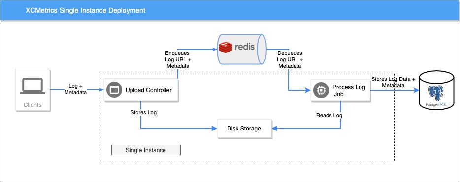
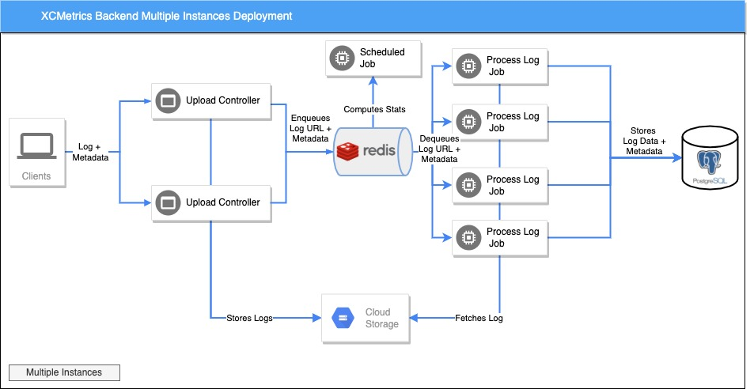
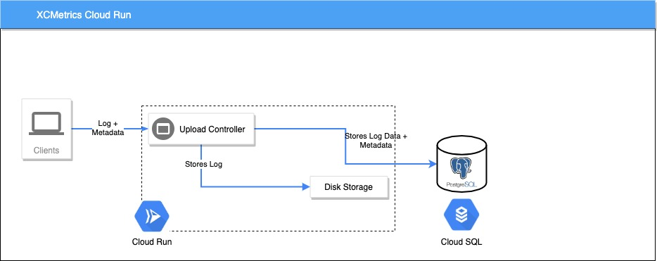
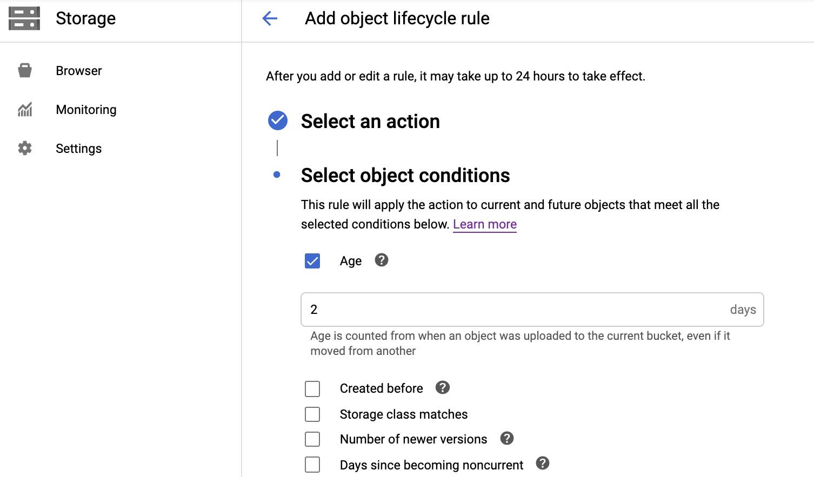
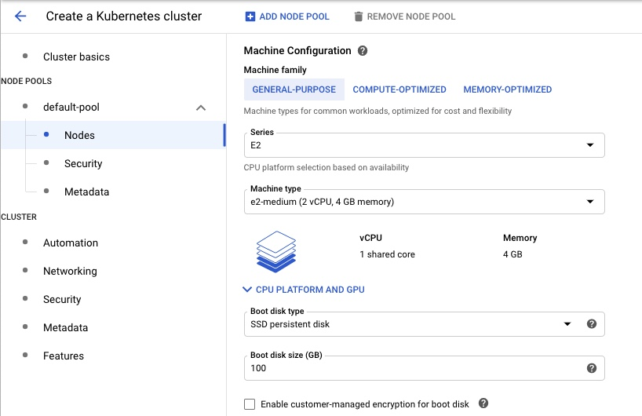

# Backend Deployment

This repo includes a Dockerfile that you can use to build a docker image (`docker build .`) that can be deployed to the cloud.

## 1. Requirements

The Backend needs Redis, a PostgreSQL database and optionally a Google Cloud Storage Bucket.

You can pass the setting of those servers as Environment Variables:

- **`REDIS_HOST`** IP of the Redis server. Example: `127.0.0.1`
- **`REDIS_PORT`** Port of the Redis server. Example: `6379`
- **`DB_HOST`** PostgreSQL host. The default value is `localhost`
- **`DB_PORT`** PostgreSQL port. The default value is `5036`
- **`DB_USER`** PostgreSQL user. The default value is `xcmetrics-dev`
- **`DB_PASSWORD`** PostgreSQL user's password. The default value is `xcmetrics-dev`
- **`DB_NAME`** Name of the database. The default value is `xcmetrics-dev`

#### GDPR and Privacy

- **`XCMETRICS_REDACT_USER_DATA`** If this flag is `"1"` the Data will be anonymized, meaning that both the username and the machine name will be hashed using MD5 and the hash will be stored instead of the full names. Also, in all the file paths contained in the logs, the User folder will be redacted. For instance, instead of `/Users/mary/MyProject`, the data inserted in the tables will have `Users/<redacted>/MyProject` paths

## Single instance deployment

The easiest way to deploy the Backend is using only one instance that have both the Endpoints and the Job in the same process. 

In this case, you don't need Google Cloud Storage. The Endpoint's controller will store the log files in disk and, because the Job will be running in the same machine, the Job will just read them from there.



Having a single instance running limits the amount of logs that can be processed. A Job runs in an EventLoop and Vapor creates one per CPU core, aditionally each EventLoop has a Database pool. This makes the max number of logs that can be processed in parallel to be:

**number of cores** * **connections per pool**

By default, we configure **10** connections per pool. You can change that number if your Database instance supports it.

You can check an example Kubernetes deployment files of this scenario in the folder `DeploymentExamples/SingleInstance`

## Multi instance deployment

Having multiple instances will make the Backend to be more fault tolerant and more performant. You can process more logs in parallel. 

By far, the most resource-consuming task that the Backend does is parsing the Xcode logs. So it's advisable to deploy more instances that only run the ProcessLogJob than instances with the Endpoint to upload the Logs.

This diagram shows how such a deployment will look like:





For this to work, you'll need to configure an extra Set of Environment Variables:

- **`XCMETRICS_START_JOBS_SAME_PROCESS`** Should be set to `"0"`. This will instruct the backend to not start the ProcessLogJob in the same instance than the Endpoints.

In this configuation, the Controller needs to store the logs in the Cloud, not in disk. So the Jobs can download them from there. XCMetrics supports two Cloud Storage Systems: **Amazon S3** and **Google Cloud Storage**

### Amazon S3

You will need to create a new S3 Bucket and a new User with permissions to write and read from it. You can follow the instructions in this [Amazon AWS document](https://docs.aws.amazon.com/AmazonS3/latest/dev/example-walkthroughs-managing-access-example1.html)

- **`XCMETRICS_USE_S3_REPOSITORY`** Should be set to `"1"`.
- **`XCMETRICS_S3_BUCKET`**. The name of the Bucket in S3. You need to create the Bucket manually.
- **`XCMETRICS_S3_REGION`**. The region where the bucket lives, use the identifiers listed in [Amazon documentation](https://docs.aws.amazon.com/general/latest/gr/s3.html).
- **`AWS_ACCESS_KEY_ID`**. The Access Key Id of an Amazon IAM User with permissions to the bucket
- **`AWS_SECRET_ACCESS_KEY`**. The Secret Access Key Id of an Amazon IAM User with permissions to the bucket

### Google Cloud Storage

- **`XCMETRICS_USE_GCS_REPOSITORY`** Should be set to `"1"`.
- **`XCMETRICS_GOOGLE_PROJECT`** Identifier of the Google Project where the GCS Bucket lives.
- **`XCMETRICS_GCS_CREDENTIALS`** Path to the `.json` Google Cloud credentials file. The service account to which the credentials belong to, should have write and read permisions on the GCS Bucket
- **`XCMETRICS_GCS_BUCKET`** Name of the Bucket where the log files will be stored.

You can find example Kubernetes deployment's files of this scenario in the folder `DeploymentExamples/MultiInstances`


## Google Cloud Run Deployment

One quick option to deploy the backend is using Cloud Run in a Google Cloud Project. You will need a PostgreSQL instance deployed outside of Cloud Run, typically in Cloud SQL. One key feature in Cloud Run, is that you only get charged when your App is being used. If there are not requests to it, all instances will be removed and a new one will be spawned when a new request arrives. This makes Cloud Run not a good choice to run Async Jobs, the instance could be killed in the middle of processing a log. Thus, in this case you can disable the jobs and process the logs in the same Endpoint. The response time of the request will be longer, because it will wait for the log to be processed and inserted into the Database before responding to the XCMetrics Client, but Cloud Run plays well with this kind of Endpoints.



**Important** When you use Cloud Run, the XCMetrics client needs to point to the `metrics-sync` endpoint. In your Xcode's PostAction edit it to something like:

```shell
${SRCROOT}/../../XCMetricsLauncher ${SRCROOT}/../../.build/release/XCMetrics --name BasicApp --buildDir ${BUILD_DIR} --serviceURL https://yourservice.com/v1/metrics-sync
```

## 1. Use our Cloud Run button

The easiest way to start is to click on the following "Run on Google Cloud" button. You will need to configure Cloud SQL manually, you can read the details in the next section.

[](https://deploy.cloud.run)

## 2. Or enable it manually

1. Enable Cloud Run and Cloud Build in your Google Cloud Project.

2. Setup your Cloud SQL PostgreSQL database. Follow the instructions of the [Using Google Cloud SQL section](#using-google-cloud-sql)

4. Add permissions to Cloud's Run Service Account for Cloud SQL. By default, Cloud Run uses the service account named `<project number>-compute@developer.gserviceaccount.com`. It will need the permissions **Cloud SQL Client**

5. You can skip the next sections if you're using "Run in Google Cloud" button. Next, you need to build a Docker image and deploy it using Cloud Run:

```shell
gcloud builds submit --tag gcr.io/<my_gcp_project>/xcmetricsserver --timeout=30m
```

6. Use the [Cloud Run console](https://console.cloud.google.com/run) to crrate a new Service using the Image you just uploaded. When you're creating it you need to add the Cloud SQL Connection in Advanced Settings as [described here](https://cloud.google.com/sql/docs/postgres/connect-run#configuring)

You will need some specific Env Variables setup so the App can run in this environment:

- **`XCMETRICS_USE_ASYNC_LOG_PROCESSING="0"`** Should be 0, Cloud Run can't run Asynchronous jobs. 
- **`XCMETRICS_USE_CLOUDSQL_SOCKET="1"`** Cloud Run uses Unix Sockets to connect to Cloud Run.
- **`XCMETRICS_CLOUDSQL_CONNECTION_NAME`**. You can find this name in the Cloud SQL console. It's usually `my_project:gcp_region:cloudql_instance_name`
- **`DB_NAME="database name"`**. The name of the database
- **`DB_USER="database user"`**. The name of the user with permissions on the database
- **`DB_PASSWORD`**. Password to the database, you can also add it as a **Secret** to Cloud Run


## Using Google Cloud SQL

Google offers Managed PostgreSQL instances in its Cloud SQL product. If you want to use one of this as the database of XCMetrics, you will need to do some extra configuration to use it from GKE.

### 1. Create the XCMetrics database

Create a new CloudSQL Instance for PostgreSQL. The Backend needs PostgreSQL 11.0 or 12.0. You can follow the instructions [here](https://cloud.google.com/sql/docs/postgres/quickstart)

Once you created a CloudSQL Instance, Connect to the instance using the [Cloud Shell](https://cloud.google.com/sql/docs/postgres/quickstart#connect) and create a Database, a user and a password that will be used by the Backend. You can do that by running this script:

```sql
CREATE DATABASE xcmetrics;
CREATE USER xcmetrics WITH ENCRYPTED PASSWORD 'mypassword';
GRANT ALL PRIVILEGES ON DATABASE xcmetrics to xcmetrics;
```

### 2. Setup Cloud SQL Proxy

Cloud SQL Proxy will allow you to connect to the database from your computer and from GKE (If you choose to deploy the Backend using Kubernetes). Follow [this instructions](https://cloud.google.com/sql/docs/postgres/quickstart-proxy-test) to enable it and to test it locally. Once you connect to it locally, you can use a PostgreSQL client (Postico is a good one) from your computer to query the tables once they have data.


### 3. Give permissions to your Service Account

The next step is to assign permissions to the Google Service Account that you're going to use with XCMetrics. Especifically, you will need the **Cloud SQL Client** permission and ghe **Storage Admin**:


### 4. Kubernetes (GKE) configuration

If you plan to deploy the Backend to GKE, You will need to do two things in order to connect it to Cloud SQL: create a Kubernetes Secret to store the password and the Google Service Account and setup Cloud SQL as a sidecar container. You can find the instructions [here](https://cloud.google.com/sql/docs/postgres/connect-kubernetes-engine)


## Deploy to GKE

### Pre requisites

1. A Google Cloud Project

2. Install The `gcloud` command line tools ([download page](https://cloud.google.com/sdk/docs/downloads-versioned-archives) and configure it with your project by running `gcloud init`.

3. Setup Cloud SQL following the instructions of the previous section.

4. If you're planning to do a MultiInstance deployment, create a Google Cloud Storage Bucket. Use the same region where your Cloud SQL Instance is. A good advice is to add a Lifecycle Policy, so the logs will be automatically removed after a period. Open the bucket you just created and look for the `Lifecycle` menu in the upper bar. In this example we're setting up that the logs will be deleted after 2 days:



5. Create a new Service Account and give it the permissions for CloudSQL Client and Storage Admin. Generate a JSON credentials file and save it locally. You can check the steps in [this page](https://cloud.google.com/iam/docs/creating-managing-service-accounts).

6. Enable the Cloud Build API in your project following the **Before you begin** instructions in [this document](https://cloud.google.com/cloud-build/docs/quickstart-build)


### 1. Create a GKE Cluster

Create [a new GKE Cluster](https://cloud.google.com/kubernetes-engine/docs/how-to/creating-a-cluster) in the same Google Cloud project where your Cloud SQL is running.

Don't forget to select the same Region where the Cloud SQL database and the Cloud Storage bucket are for the cluster.

In the wizard, open the `Nodes Groups` and select the `Default Pool`. Change the number of nodes to be 5. (By default is set to 3).
Open the `Nodes` menu and change the Machine Type to be `e2-medium`, also change the Disk to use SSD




### 2. Setup the Kubernetes Tools.

You will need to install [kubectl](https://cloud.google.com/kubernetes-engine/docs/how-to/creating-a-cluster). Once that's done, you need to configure you're new cluster. Run this command with the name of the cluster you created in step 1:

```shell
gcloud container clusters get-credentials name-of-cluster
```

### 3. Build and upload an image with the XCMetrics Backend

From the root of the project (where the Dockerfile is), run this command changing the name of the project for yours.

```shell
gcloud builds submit --tag gcr.io/my-gcp-project/xcmetrics --timeout=30m
```

### 4. Create Kubernetes Secrets

We will store in the Kubernetes Secrets two values: the Service account's credentials JSON file you created in the Pre Requisites and the password to the database. Run these commands:

```shell
kubectl create secret generic google-service-account \
--from-file=service_account.json=/path/to/credentials.json
```

```shell
kubectl create secret generic db-secret \
  --from-literal=password='database password'
```

### 5. Deploy the Kubernetes artifacts

Go to the **DeploymentExamples** folder and choose one type: either SingleInstance or MultiInstances (check the beginning of this document to know the differences) and change to that folder.

You will need to edit some values.

In `xcmetrics-service.yaml`:

1. Change the image value to the uri you used to create it in Step 3  (`gcr.io/my-gcp-project/xcmetrics`).
2. Replace the name of your Cloud SQL connection name here:
```yaml
        command: ["/cloud_sql_proxy",
                  "-instances=Replace with your Cloud SQL connection string=tcp:5432",
                  "-credential_file=/secrets/service_account.json"]
```
3. For Multi instance deployments: Change the name of the environment variables **`XCMETRICS_GOOGLE_PROJECT`** and **`XCMETRICS_GCS_BUCKET`**.

For MultiInstance Deployments, in `xcmetrics-jobs-deployment.yaml`

1. Change the image to the uri you used to create it in Step 3  (`gcr.io/my-gcp-project/xcmetrics`).
2. Replace the name of your Cloud SQL connection name here:
```yaml
        command: ["/cloud_sql_proxy",
                  "-instances=Replace with your Cloud SQL connection string=tcp:5432",
                  "-credential_file=/secrets/service_account.json"]
```
3. Change the name of the environment variables **`XCMETRICS_GOOGLE_PROJECT`** and **`XCMETRICS_GCS_BUCKET`**.

Now, you're ready to deploy the XCMetrics artifacts:

Deploy the Redis artifacts:
```shell
kubectl create -f xcmetrics-redis-deployment.yaml
kubectl create -f xcmetrics-redis-service.yaml
```

Deploy XCMetrics
```shell
kubectl create -f xcmetrics-deployment.yaml
kubectl create -f xcmetrics-service.yaml
```

For MultiInstances deployments, deploy the XCMetrics Jobs:
```shell
kubectl create -f xcmetrics-jobs-deployment.yaml
kubectl create -f xcmetrics-jobs-service.yaml
```

### 6. Verify the deployment

Run the command `kubectl get services`. You should get the list of the Services deployed and the External IP for the XCMetrics Backend:

```shell
NAME               TYPE           CLUSTER-IP    EXTERNAL-IP     PORT(S)        AGE
kubernetes         ClusterIP      10.12.0.1     <none>          443/TCP        5h4m
redis              ClusterIP      10.12.10.21   <none>          6379/TCP       139m
xcmetrics-jobs     ClusterIP      10.12.1.144   <none>          80/TCP         116m
xcmetrics-server   LoadBalancer   10.12.5.86    35.187.83.33   80:30969/TCP   139m
```

You can run `curl -i http://external ip/v1/builds` to verify that everything is working. You should get a response like:

```shell
curl -i http://35.187.83.38/v1/builds
HTTP/1.1 200 OK
content-type: application/json; charset=utf-8
content-length: 53
connection: keep-alive
date: Wed, 14 Oct 2020 17:48:00 GMT

{"metadata":{"total":0,"page":1,"per":10},"items":[]}
```

Use the new URL in your XCMetrics client. Pass the `--serviceURL` with the new value. In this example will be `http://35.187.83.38/v1/metrics`
